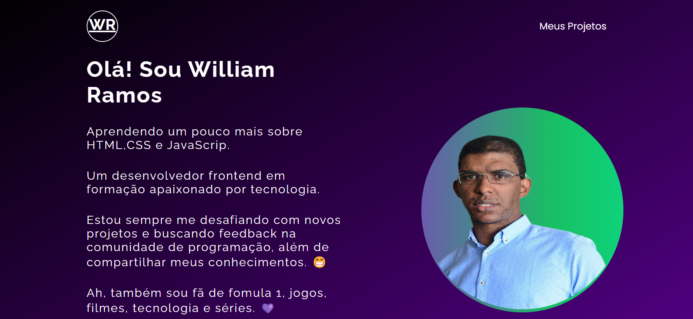

<h1 align="center"> Projeto GTA V </h1>

Projeto desenvolvido na Semana do 0 ao Programador no  canal DEV EM DOBRO  

  <a href="#-tecnologias">Tecnologias</a>&nbsp;&nbsp;&nbsp;|&nbsp;&nbsp;&nbsp;
  <a href="#-projeto">Projeto</a>&nbsp;&nbsp;&nbsp;|&nbsp;&nbsp;&nbsp;
  <a href="#-layout">Layout</a>&nbsp;&nbsp;&nbsp;|&nbsp;&nbsp;&nbsp;
  <a href="#memo-licença">Licença</a>

  

 

<<<<<<< HEAD
  

## 🚀 Tecnologias

Esse projeto foi desenvolvido com as seguintes tecnologias:

- HTML, CSS e JS
- Git e Github

## 💻 Projeto

Projeto sobre Portifólio de Projetos .

- [Acesse o projeto finalizado, online](https://github.com/williamsramos/portifolio-simplificado)
- [Acesse o site do projeto finalizado, online](https://williamsramos.github.io/portifolio-simplificado/)
- [Acesse o site do projeto finalizado, online](https://portifolio-simplificado.vercel.app)

## :memo: Licença

Esse projeto está sob a licença MIT.

---

Feito após curso da  ♥ by Dev em Dobro :wave:
